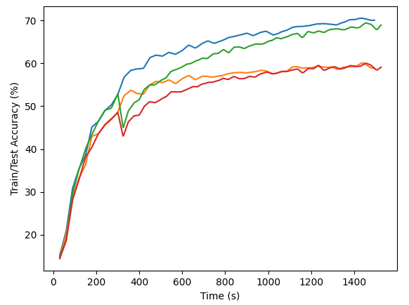

# Pruning the Bottleneck Layers of the DenseNet CNN Architecture for Deep Learning Image Classification
Independent research project by Jack DeLano

**Overview**

This project aims to improve the efficiency of DenseNets for both training and inference. The code for the DenseNet model was heavily modified from the version here: https://github.com/andreasveit/densenet-pytorch

**Rationale**

In the “bottleneck” version of the DenseNet architecture, a 1x1 convolution is used to compress the input channels generated by previous layers of a dense block. However, some of these channels contribute more than others. By analyzing the values in the learned convolution kernel, the weakest input channels can be disconnected to produce a shallower kernel which requires less computation when performing the convolution operation.

**Methodology**

To understand exactly how the pruning is performed, imagine an mxn matrix, where m is the number of output channels, n is the number of input channels, and each entry in the matrix is the weight in the 1x1 convolution kernel corresponding to a particular input and output channel pair. To make sure that each output channel counts equally, normalize each row, so that the row vectors of the matrix are unit vectors. Then, calculate the L2 norm of each column, which provides an "importance" metric for each input channel. The overall mxnx1x1 convolution kernel for the bottleneck layer can now be pruned of its least important input channel connections. Note that the described modifications to the kernel (e.g., row normalization) are performed out-of-place solely for the purpose of the pruning analysis. The only change made to the original kernel itself is the removal of input channel connections.

**Evaluation**

The pruning technique was evaluated with a DenseNet architecture with compression (i.e., a transition block between dense blocks to reduce the number of channels before pooling) containing 3 dense blocks, each with 6 bottleneck layers (i.e. a 1x1 bottleneck convolution followed by a standard 3x3 convolution, with appropriate batch normalization and ReLU activations). The model ended with a shallow feed-forward neural network with a final softmax layer for classification. It was trained and tested on the CIFAR-100 image classification dataset, utilizing an Nvidia GTX 1080ti.

First, appropriate hyperparameters were determined for an unpruned version of the model. These same hyperparameters were used for the pruned version, which had a pruning factor of 0.25 (i.e. 75% of the input channels to each bottleneck layer were disconnected). The pruning took place early in the training process -- after 10 epochs. The unpruned model was allowed to train for 50 epochs. Since the pruned model was able to complete each epoch faster, it was allowed to train for 60 epochs so that the total training time for each model was approximately equal. The resulting train and test accuracies were averaged over 4 trials for each version.

**Results**

The unpruned model took about 30.1 seconds per epoch to train, whereas the pruned model took about 24.5 seconds (after epoch 10). Because of the increased traning speed, the pruned model was able to complete more training iterations than the unpruned model in the same period of time. As seen in Figure 1, this allowed the pruned model to catch up to the unpruned model in terms of accuracy on the test set.

**Figure 1.** Pruned and unpruned model accuracies on test and train sets, averaged over 4 trials each. Blue: Unpruned training accuracy; Green: Pruned training accuracy; Orange: Unpruned test accuracy; Red: Pruned test accuracy.

The figure also shows the temporary sharp reduction in test and train set accuracy for the pruned model at epoch 10, which is expected due to most of the bottleneck input channels being disconnected at that time.

It's important to observe that the resulting pruned model would be able to complete inference faster than the unpruned model after the training process is completed. And, that is with an equivalent accuracy on the test set, which was achieved in the same amount of time during the training process.

**Notes**

See https://arxiv.org/pdf/1608.06993.pdf for specific information and terminology about DenseNets.
